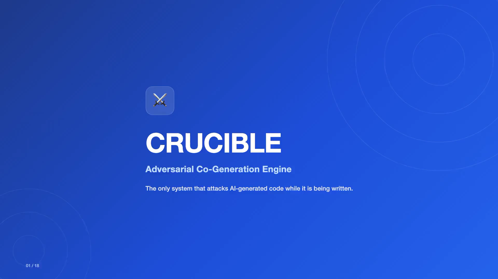

<div align="center">

# ⚔️ CRUCIBLE

### Adversarial Co-Generation Engine

**Generates code and adversarial attacks from the same specification, at the same time — before a commit exists.**

[](https://github.com/sanjoy1234/crucible/actions)
[](https://pypi.org/project/crucible-ai/)
[](https://pypi.org/project/crucible-ai/)
[](LICENSE)
[](#requirements)

[**What it is**](#what-it-is) ·
[**See it run**](#see-it-run) ·
[**Quickstart**](#quickstart) ·
[**Commands**](#cli-reference) ·
[**Domains**](#compliance--domain-coverage) ·
[**Deep Dive**](docs/DEEP_DIVE.md)

</div>

---

## What it is

Every AI coding tool ships code and hopes someone tests it for security later.
CRUCIBLE removes the "later." It runs two agents concurrently against the same
specification:

- **Builder** — generates the implementation
- **Breaker** — generates adversarial attacks against the same spec, at the same instant

An **Arbiter** scores every attack (mitigated / partial / missed) and produces
an **Adversarial Resilience Score (ARS)**. A configurable gate blocks your CI
pipeline when the score falls below threshold — the same way a failing test
suite blocks a merge.

No manual test authoring. No separate security review step. No waiting for a
scanner to catch up to code that shipped last week.

---

## See it run

<a href="docs/media/CRUCIBLE_Demo.mp4">
  
</a>

**▶ [Watch the 2.5-minute demo](docs/media/CRUCIBLE_Demo.mp4)** — setup through CI gate, real terminal output, real dashboard.

**📊 [Read the one-page overview (PDF)](docs/media/CRUCIBLE_Overview.pdf)** — what it is, what's different, how it deploys. Built for sharing with a technical lead or architecture review board.

---

## Why it's structurally different

Three properties, not features — the reasoning behind each is in the [Deep Dive](docs/DEEP_DIVE.md):

1. **Concurrent, not sequential.** Builder and Breaker fire at the same instant via `asyncio.gather()`. The Breaker never sees generated code — it reasons from the specification alone, the same surface a real attacker would work from before your implementation choices exist.
2. **A native MCP integration, both directions.** CRUCIBLE exposes itself as an MCP server so Claude Code, Cursor, Windsurf, or Zed can trigger and poll runs directly from your coding tool — and it consumes external MCP servers (plus built-in CISA KEV / NIST NVD feeds) to enrich every run with live threat data. See the [Domain Intelligence](docs/DOMAIN_INTELLIGENCE.md) page for exactly what's live vs. static.
3. **Regulatory domains as first-class input.** FINRA, HIPAA, PCI DSS, SOC 2, and OWASP Top 10 playbooks steer the Breaker toward the scenarios that actually matter for a regulated codebase — not a generic scan re-labeled per industry.

---

## Quickstart

```bash
# 1. Install
pip install crucible-ai

# 2. Interactive setup — detects and validates the best model for your environment
#    (Ollama for free/air-gapped, OpenRouter free tier, or your own API key)
crucible setup

# 3. Run on the included demo spec
crucible run --issue examples/demo_issue.md --mode quick --pretty
```

`crucible setup` writes a `.crucible.yml` for you — there is no manual
configuration step, and no fallback to whatever API key happens to be lying
around the environment. What you configure is what runs.

```
──────────────────────────────────────────────────────────────────────
  CRUCIBLE Adversarial Run
  Mode:      quick (5 attacks)
  Language:  python  [signals: filesystem, async]
  Domain:    owasp_top10
──────────────────────────────────────────────────────────────────────
  ARS Score: 0.87  ✅  PASSED  (gate: ≥ 0.80)

  ✅ CWE-89  SQL Injection via username param     mitigated
  ✅ CWE-502 Unsafe deserialization                mitigated
  ✅ CWE-78  OS command injection in file path     mitigated
  ✅ CWE-22  Path traversal in upload handler       mitigated
  ❌ CWE-79  Reflected XSS in error message         MISSED
──────────────────────────────────────────────────────────────────────
```

Wall-clock time depends on which model you configure — anywhere from single-digit
seconds with a fast paid API to several minutes with a free-tier or local model.
Attack count is fixed per mode regardless of provider: `quick` = 5, `standard` = 20,
`thorough` = 50.

### Run against a GitHub issue directly

```bash
crucible run --issue https://github.com/your-org/your-repo/issues/42 --mode standard --domain hipaa --pretty
```

### Requirements

- Python 3.11+
- macOS, Linux, or Windows (WSL2 recommended on Windows)
- One model provider: [Ollama](https://ollama.com) (free, local), OpenRouter free tier, or an Anthropic/OpenAI API key

---

## CLI reference

All 22 commands, grouped by when you'd reach for them:

| Getting started | |
|---|---|
| `crucible setup` | Configure model provider and integrations (run any time to reconfigure) |
| `crucible init` | Scaffold `.crucible.yml` with sensible defaults |
| `crucible doctor` | Full environment health check |
| `crucible validate` | Dry run — checks config and connectivity, fires zero attacks |

| Running assessments | |
|---|---|
| `crucible run` | Run adversarial Builder + Breaker on a spec |
| `crucible status` | Show running and recently completed runs |
| `crucible findings` | Vulnerability findings from the last run — fix-first, score last |
| `crucible compare` | Diff two Resilience Reports — ARS delta and attack-level changes |
| `crucible learn` | Feed a completed run into the Knowledge Forge |

| Evidence & compliance | |
|---|---|
| `crucible report` | Render a stored report in any output format (HTML/SARIF/JUnit/JSON) |
| `crucible verify` | Re-derive SHA-256 integrity hash, confirm a report hasn't been altered |
| `crucible audit` | List all reports with compliance control mapping over a time window |
| `crucible vault` | Browse the Forge Ledger — human-readable Markdown attack records |
| `crucible stats` | ARS trends, learning-curve, and cost metrics |

| Domains & policy | |
|---|---|
| `crucible policy` | List, install, search, or validate policy domains — see [Domain Intelligence](docs/DOMAIN_INTELLIGENCE.md) |

| Team & CI deployment | |
|---|---|
| `crucible integrate` | One command: wire CRUCIBLE into Claude Code, Cursor, Windsurf, Copilot, Codex, or GitHub Actions |
| `crucible mcp-server` | Start CRUCIBLE as an MCP server (stdio transport) for local IDE use |
| `crucible serve` | Start CRUCIBLE as a webhook/CI service, with optional GitHub team-based RBAC |
| `crucible dashboard` | Launch the Combat Dashboard web UI |
| `crucible leaderboard` | Build an ARS leaderboard across multiple agents/runs |
| `crucible forge-network` | Opt-in community adversarial pattern sharing |
| `crucible prune` | Remove expired reports |

Full usage, flags, and examples for every command: [Deep Dive → Complete CLI Reference](docs/DEEP_DIVE.md#complete-cli-reference).

---

## Language support

Auto-detected from the specification — no per-project configuration:

| Language | Priority CWEs (examples) |
|---|---|
| Python | SQL injection, OS command injection, unsafe deserialization, path traversal |
| JavaScript / TypeScript | Prototype pollution, XSS, CSRF, SSRF |
| Java | Deserialization, XXE, authorization bypass |
| Go | Race conditions, nil-pointer dereference, resource exhaustion |

---

## Compliance & domain coverage

5 regulated-industry playbooks ship today — **43 attack scenarios total**, each
mapped to a specific rule or control, not a generic label:

| Domain | Scenarios | Regulatory framework |
|---|---|---|
| `owasp_top10` | 12 | OWASP Top 10 (2021/2025) |
| `finra` | 9 | FINRA Rules 4370, 3110; SEC Rule 17a-4 |
| `hipaa` | 9 | HIPAA Security Rule (45 CFR §§160, 164) |
| `soc2` | 7 | AICPA SOC 2 Trust Service Criteria |
| `pci_dss` | 6 | PCI DSS v4.0 |

Two more (`owasp_api_security`, `nist_ssdf`) are available via `crucible
policy install`. GDPR, FedRAMP, and DORA are on the [roadmap](docs/DEEP_DIVE.md#roadmap)
— not available today.

**For exactly what's live threat data vs. static playbook content, and how to
bring your own domain, see the full
[Domain Intelligence page](docs/DOMAIN_INTELLIGENCE.md).**

---

## Enterprise deployment

- **`crucible dashboard`** — ARS trend, gate status, and attack-outcome breakdown across every connected repository. One URL for the team.
- **`crucible serve --rbac`** — GitHub team-based access control (admin / reviewer / developer) across a shared instance.
- **`crucible audit`** — every run listed with NIST SSDF / OWASP SAMM / SOC 2 control mapping, for a configurable window.
- **Air-gapped operation** — the full engine runs on local Ollama with zero outbound calls, for environments that can't reach the internet.

Full detail on each: [Deep Dive → Enterprise Features](docs/DEEP_DIVE.md#enterprise-features).

---

## Learn more

- **[Deep Dive](docs/DEEP_DIVE.md)** — the full story: why concurrent execution matters, how CRUCIBLE compares to SAST/DAST/pentest, the complete CLI and configuration reference, architecture, FAQ, and roadmap.
- **[Domain Intelligence](docs/DOMAIN_INTELLIGENCE.md)** — exactly what's covered per regulated domain, what's live vs. static, and how to extend it.
- **[Contributing](docs/DEEP_DIVE.md#contributing)** — how to add a policy domain, a language profile, or a feature.

---

<div align="center">

MIT License · Built by **[Sanjoy Ghosh](https://github.com/sanjoy1234)**

</div>
